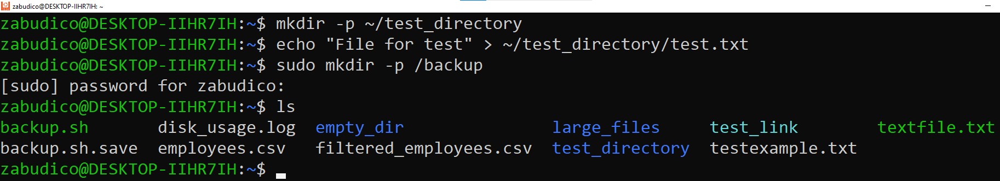
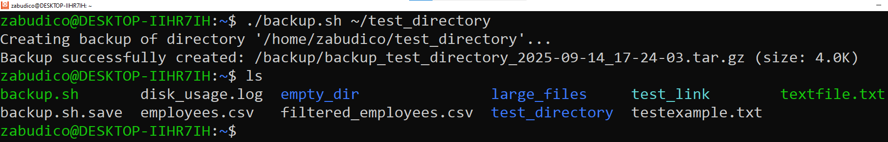
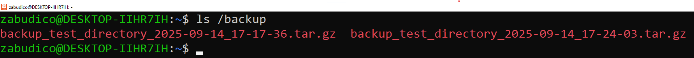
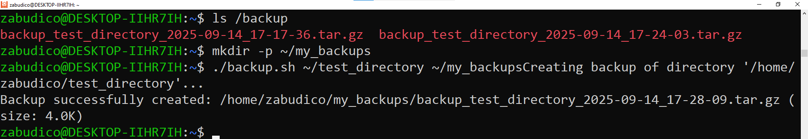
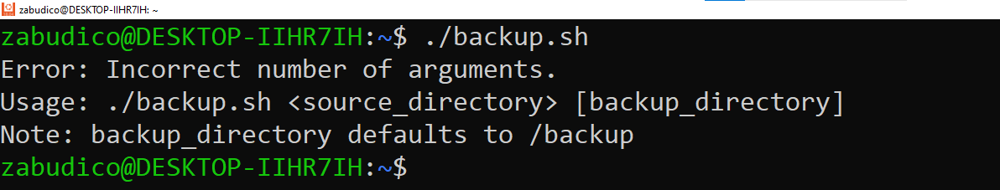
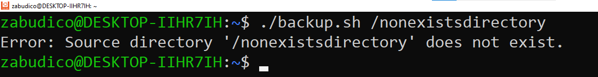
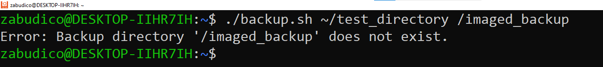
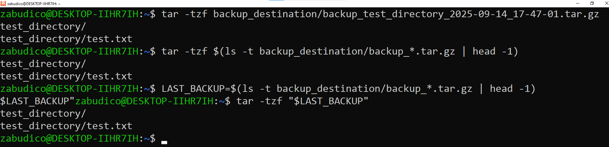

# IW01: Writing a Simple Shell Script for Task Automation

## Выполнил

- Zabudico Alexandr I2302
- Дата выполнения: 14.09.25

## Цель работы

Изучение создания и выполнения Shell-скриптов для автоматизации рутинных задач в операционной системе Linux, в частности создание скрипта для резервного копирования директории.

## Задание

Создать Shell-скрипт для автоматизации задачи резервного копирования важной директории со следующими требованиями:

1. Скрипт должен называться `backup.sh`.
2. Скрипт должен принимать два аргумента: путь к директории для резервного копирования (обязательный) и путь к директории для сохранения резервной копии (необязательный, по умолчанию `/backup`).
3. Скрипт должен создавать архив `tar.gz` с текущей датой в имени файла (формат ГГГГ-ММ-ДД).
4. Скрипт должен проверять существование указанных директорий и выводить соответствующие сообщения об ошибках.

## Подготовка

Для выполнения работы необходимо:

1. **Доступ к терминалу** - наличие работающей операционной системы Linux с возможностью выполнения команд через терминал.
2. **Проверка наличия утилиты tar** - убедиться, что система содержит архиватор tar (в большинстве дистрибутивов Linux данный инструмент включен в стандартную поставку).
3. **Подготовка тестовых данных** - создать пробную директорию с файлами, которые будут использоваться для проверки функциональности скрипта.
4. **Создание целевой директории** - подготовить папку для хранения резервных копий, например, директорию `/backup`, куда по умолчанию будут сохраняться созданные архивы.

## Выполнение работы

### 1. Создание и настройка скрипта `backup.sh`

Был разработан и реализован скрипт `backup.sh`, предназначенный для автоматизации процесса создания резервных копий директорий. Ниже представлен полный код созданного скрипта:

```bash

#!/bin/bash

# Check number of arguments
if [ $# -lt 1 ] || [ $# -gt 2 ]; then
    echo "Error: Incorrect number of arguments."
    echo "Usage: $0 <source_directory> [backup_directory]"
    echo "Note: backup_directory defaults to /backup"
    exit 1
fi

# Assign arguments to variables
SOURCE_DIR="$1"
BACKUP_DIR="${2:-/backup}"

# Check if source directory exists
if [ ! -d "$SOURCE_DIR" ]; then
    echo "Error: Source directory '$SOURCE_DIR' does not exist."
    exit 1
fi

# Check if backup directory exists
if [ ! -d "$BACKUP_DIR" ]; then
    echo "Error: Backup directory '$BACKUP_DIR' does not exist."
    exit 1
fi

# Check write permissions for backup directory
if [ ! -w "$BACKUP_DIR" ]; then
    echo "Error: No write permission for directory '$BACKUP_DIR'."
    exit 1
fi

# Create filename with current date and time
TIMESTAMP=$(date +"%Y-%m-%d_%H-%M-%S")
BACKUP_FILENAME="backup_$(basename "$SOURCE_DIR")_$TIMESTAMP.tar.gz"
BACKUP_PATH="$BACKUP_DIR/$BACKUP_FILENAME"

# Create backup
echo "Creating backup of directory '$SOURCE_DIR'..."
if tar -czf "$BACKUP_PATH" -C "$(dirname "$SOURCE_DIR")" "$(basename "$SOURCE_DIR")" 2>/dev/null; then
    # Check size of created archive
    BACKUP_SIZE=$(du -h "$BACKUP_PATH" | cut -f1)
    echo "Backup successfully created: $BACKUP_PATH (size: $BACKUP_SIZE)"
else
    echo "Error: Failed to create backup."
    exit 1
fi

```

### Настройка скрипта были выполнены следующим образом:

**Процесс создания исполняемого файла:**

1. Файл скрипта был создан с использованием команды `touch backup.sh`
2. Содержимое скрипта было добавлено и отредактировано через текстовый редактор `nano`
3. Права на выполнение были предоставлены с помощью команды `chmod +x backup.sh`

### 2. Подготовка тестового окружения

Для верификации корректной работы скрипта было развернуто тестовое окружение, включающее:

- Создание тестовой директории с демонстрационными файлами
- Подготовку целевой директории для хранения резервных копий

```bash
mkdir -p ~/test_directory
echo "File for test" > ~/test_directory/test.txt
sudo mkdir -p /backup
```

**Вывод:**



Тестовая среда готова для проверки функциональности скрипта резервного копирования.

### 3. Тестирование скрипта

Скрипт был протестирован в следующих сценариях:

#### Тест 1: Успешное создание резервной копии с указанием двух директорий

```bash
./backup.sh ~/test_directory
```

**Вывод:**



**Проверка результата:**

```bash
ls /backup
```



#### Тест 2: Успешное создание резервной копии с указанной директорией

```bash
mkdir -p ~/my_backups
./backup.sh ~/test_directory ~/my_backups
```

**Проверка результата:**

```bash
ls ~/my_backups
```

Вывод:



#### Тест 3: Запуск без аргументов

```bash
./backup.sh
```

**Вывод:**



#### Тест 4: Указание несуществующей исходной директории

```bash
./backup.sh /nonexistsdirectory
```

**Вывод:**



#### Тест 5: Указание несуществующей целевой директории

```bash
./backup.sh ~/test_directory /imaged_backup
```

**Вывод:**



### 4. Проверка содержимого архива

Для проверки содержимого созданного архива были использованы команды:

```bash
tar -tzf backup_destination/backup_test_directory_2025-09-14_17-47-01.tar.gz

tar -tzf $(ls -t backup_destination/backup_*.tar.gz | head -1)

LAST_BACKUP=$(ls -t backup_destination/backup_*.tar.gz | head -1)
tar -tzf "$LAST_BACKUP"

```

Все три команды успешно показали содержимое архива, подтвердив наличие структуры директории `test_directory` и файла `test.txt` внутри архива.

**Вывод:**



## Выводы

В рамках практической работы был разработан и всесторонне протестирован скрипт `backup.sh` для автоматизации процесса резервного копирования. Реализованное решение демонстрирует высокую эффективность в обработке параметров командной строки: корректно интерпретирует обязательные и опциональные аргументы, генерирует архивы в формате `tar.gz` с детальной временной меткой в названии, а также выполняет комплексную валидацию исходных и целевых директорий.

Проведенное тестирование подтвердило устойчивость скрипта к различным сценариям использования, включая обработку ошибочных ситуаций и исключительных состояний. Разработанный инструмент успешно интегрируется в рабочие процессы системного администрирования, демонстрируя практическую ценность `shell-скриптинга` для оптимизации рутинных операций.

Освоенные методики создания скриптовых решений позволяют не только автоматизировать задачи резервного копирования, но и формируют основу для разработки более сложных систем автоматизации в среде Linux.

## Библиография

- [GNU Tar Manual](https://www.gnu.org/software/tar/manual/) - официальное руководство по работе с архиватором tar, содержащее исчерпывающую информацию о ключах создания и управления архивами.
- [Advanced Bash-Scripting Guide](https://tldp.org/LDP/abs/html/) - фундаментальное руководство по программированию на Bash, охватывающее продвинутые техники работы с переменными, управляющими конструкциями и обработкой ошибок.
- [Linux Command Line and Shell Scripting Bible](https://www.wiley.com/en-us/Linux+Command+Line+and+Shell+Scripting+Bible%2C+4th+Edition-p-9781119700913) - комплексное пособие по созданию скриптов для автоматизации системных задач, включая лучшие практики и паттерны проектирования.
